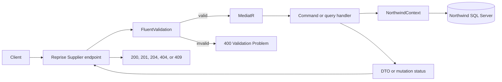

<!-- markdownlint-disable-file -->
# Task Research: Suppliers CRUD Web API

Research the repository's established patterns and define an implementation-ready approach for complete CRUD operations for the `Suppliers` entity.

## Task Implementation Requests

* Add create, read, update, and delete HTTP operations for suppliers
* Preserve the existing ASP.NET Core, MediatR CQRS, Reprise endpoint, AutoMapper, FluentValidation, and EF Core conventions
* Define focused validation and verification steps

## Scope and Success Criteria

* Scope: Supplier API models, CQRS requests and handlers, mapping, endpoint definitions, dependency registration, HTTP examples, and automated tests where supported
* Exclusions: Direct changes to EF Core Power Tools generated entities and unrelated product or customer behavior
* Assumptions: `Suppliers` is backed by the configured Northwind database and supplier routes should follow the nearest existing CRUD implementation
* Success Criteria:
  * Every CRUD operation has a specified route, request and response contract, status semantics, handler flow, and validation behavior
  * The selected design aligns with verified repository conventions and avoids editing generated database files
  * Implementation steps include exact file locations and executable validation guidance

## Outline

1. Inspect the existing product CRUD vertical slice and supplier EF model configuration
2. Inspect application registration, exception handling, mapping, and integration-test infrastructure
3. Verify relevant framework behavior and identify risks
4. Evaluate endpoint and request-shape alternatives
5. Select one implementation approach and provide implementation-ready examples

## Potential Next Research

* Verify Reprise 3.7.0 endpoint discovery and generated OpenAPI on .NET 10
  * Reasoning: The package documentation predates ASP.NET Core 8 through 10
  * Reference: `WebApiMediatorCQRS/WebApiMediatorCQRS.csproj:9-19`
* Verify deployed SQL Server key and foreign-key metadata
  * Reasoning: The generated EF model relies on key-generation convention and does not prove the database's `IDENTITY` or delete action
  * Reference: `WebApiMediatorCQRS/Database/NorthwindContext.cs:256-291,317-342`
* Confirm whether pagination, PATCH, ETags, or stricter format rules are product requirements
  * Reasoning: None exists in the Product CRUD precedent, and adding one only for Suppliers would make the API inconsistent
  * Reference: `WebApiMediatorCQRS/Endpoints/GetProductsEndpoint.cs:8-45`

## Research Executed

### File Analysis

* `WebApiMediatorCQRS/ApiModels/ProductModels.cs:3-41`
  * Product CRUD separates response, create request, and update request records; route identity is absent from write bodies
* `WebApiMediatorCQRS/Commands/ProductCommands.cs:10-248`
  * Commands own validators and handlers; writes use tracked entities, cancellable EF Core calls, and explicit mutation statuses
* `WebApiMediatorCQRS/Queries/ProductQueries.cs:11-53`
  * Reads use `AsNoTracking`, deterministic ordering, `ProjectTo`, and cancellable asynchronous materialization
* `WebApiMediatorCQRS/Endpoints/CreateProductEndpoint.cs:9-76`
  * Create returns `201`, a resource `Location`, and the DTO; endpoint-local helpers translate domain outcomes
* `WebApiMediatorCQRS/Endpoints/GetProductsEndpoint.cs:8-45`
  * Collection and item routes are `/products` and `/products/{id:int}`
* `WebApiMediatorCQRS/Endpoints/UpdateProductEndpoint.cs:9-56`
  * `PUT` implements full replacement and returns `200` with the updated representation
* `WebApiMediatorCQRS/Endpoints/DeleteProductEndpoint.cs:8-37`
  * Delete returns `204`, `404`, or `409` and protects against dependent records
* `WebApiMediatorCQRS/Database/Suppliers.cs:1-35`
  * Generated persistence entity; direct changes would be overwritten by EF Core Power Tools
* `WebApiMediatorCQRS/Database/NorthwindContext.cs:256-291,317-342`
  * Supplier scalar constraints and the optional Product-to-Supplier relationship are configured here
* `WebApiMediatorCQRS/Program.cs:31-55,57-83`
  * Registers EF Core, MediatR, validators, AutoMapper, Reprise, exception handling, and endpoint mapping
* `WebApiMediatorCQRS.Tests/IntegrationTests.cs:5-39`
  * Current Aspire test proves application startup and `/swagger` only

### Code Search Results

* Supplier API feature types
  * No Supplier endpoint, request model, command, query, validator, or profile currently exists
* Validation pipeline
  * `ValidationBehavior<,>` is present but commented out in `WebApiMediatorCQRS/Program.cs:37-47`; Product endpoints validate explicitly
* Supplier dependency
  * `Products.SupplierId` and `Suppliers.Products` establish the delete conflict surface at `WebApiMediatorCQRS/Database/Products.cs:8-34` and `WebApiMediatorCQRS/Database/Suppliers.cs:34`

### External Research

* Microsoft Learn: `ASP.NET Core Minimal API responses`, ASP.NET Core 10
  * `201 Created` with `Location` and a response DTO fits server-generated identifiers
  * Source: [Minimal API responses](https://learn.microsoft.com/en-us/aspnet/core/fundamentals/minimal-apis/responses?view=aspnetcore-10.0)
* Microsoft Learn: `EF Core asynchronous programming`
  * Database terminal operations should be asynchronous, cancellable, and sequential on one `DbContext`
  * Source: [EF Core asynchronous programming](https://learn.microsoft.com/en-us/ef/core/miscellaneous/async)
* Microsoft Learn: `EF Core efficient querying`
  * Read-only queries should project only required properties and avoid tracking
  * Source: [Efficient querying](https://learn.microsoft.com/en-us/ef/core/performance/efficient-querying)
* Microsoft Learn: `ExecuteUpdate and ExecuteDelete`
  * `ExecuteDeleteAsync` bypasses tracking and `SaveChanges`, but it does not express the desired dependency pre-check as clearly as the local tracked-delete pattern
  * Source: [Execute update and delete](https://learn.microsoft.com/en-us/ef/core/saving/execute-insert-update-delete)
* Microsoft Learn: `Cascade delete`
  * Optional client-side null propagation does not imply database `ON DELETE SET NULL` when dependents are not tracked
  * Source: [Cascade delete](https://learn.microsoft.com/en-us/ef/core/saving/cascade-delete)
* AutoMapper queryable extensions
  * Filter and sort entity queries before `ProjectTo`; projection should be the last query-shaping operation before materialization
  * Source: [Queryable extensions](https://raw.githubusercontent.com/LuckyPennySoftware/AutoMapper/master/docs/source/Queryable-Extensions.md)
* FluentValidation asynchronous validation
  * `ValidateAsync` executes both synchronous and asynchronous rules and should receive the request cancellation token
  * Source: [Asynchronous validation](https://docs.fluentvalidation.net/en/latest/async.html)
* RFC 9110
  * `PUT` represents replacement, successful synchronous bodyless delete maps to `204`, and current-state dependency can map to `409`
  * Source: [HTTP Semantics](https://www.rfc-editor.org/rfc/rfc9110.html)

### Project Conventions

* Standards referenced: `AGENTS.md`, C# instructions, C# test instructions, Markdown instructions, and writing-style instructions
* Instructions followed: Research-only changes remain under `.copilot-tracking/research/`; generated EF Core files remain unchanged
* Existing feature precedent: Mirror the Product vertical slice unless Supplier-specific schema behavior requires a deliberate difference

## Key Discoveries

### Project Structure

Supplier CRUD belongs in the existing API feature boundaries rather than the generated database directory:

```text
WebApiMediatorCQRS/
  ApiModels/SupplierModels.cs
  Commands/SupplierCommands.cs
  Endpoints/CreateSupplierEndpoint.cs
  Endpoints/DeleteSupplierEndpoint.cs
  Endpoints/GetSuppliersEndpoint.cs
  Endpoints/UpdateSupplierEndpoint.cs
  Profiles/SupplierProfile.cs
  Queries/SupplierQueries.cs
  Suppliers.http
WebApiMediatorCQRS.Tests/
  SupplierIntegrationTests.cs
```

Assembly scanning already discovers MediatR handlers, FluentValidation validators, AutoMapper profiles, and Reprise endpoints. No `Program.cs` registration change is required if the new public types remain in the API assembly. The database entity and context are generated and must remain unchanged.

### Implementation Patterns

The implementation should preserve these verified patterns:

* Flat API DTOs expose Supplier scalar columns but never the `Products` navigation
* `SupplierId` is server controlled and appears only in responses and route-derived commands
* `CompanyName` is non-null and limited to 40 characters; all other text fields are nullable and use mapped database lengths
* Endpoints call `ValidateAsync` before `mediator.Send` because pipeline validation is disabled
* Query handlers use `AsNoTracking`, entity filtering or ordering, `ProjectTo`, then an async terminal operation
* Create initializes a `Suppliers` entity and maps it after `SaveChangesAsync` assigns the key
* Update loads by key with `FindAsync`, assigns every writable scalar, saves, and maps the result
* Delete loads the entity, checks `Products.AnyAsync`, then removes and saves; an expected `DbUpdateException` fallback handles a race
* Endpoints own HTTP translation while handlers return DTOs, null, or explicit mutation statuses
* Every asynchronous call propagates the incoming cancellation token

### Complete Examples

The API models should preserve database nullability without leaking generated navigation properties:

```csharp
namespace WebApiMediatorCQRS.ApiModels;

public record SupplierResponse(
  int SupplierId,
  string CompanyName,
  string? ContactName,
  string? ContactTitle,
  string? Address,
  string? City,
  string? Region,
  string? PostalCode,
  string? Country,
  string? Phone,
  string? Fax,
  string? HomePage);

public record CreateSupplierRequest(
  string CompanyName,
  string? ContactName,
  string? ContactTitle,
  string? Address,
  string? City,
  string? Region,
  string? PostalCode,
  string? Country,
  string? Phone,
  string? Fax,
  string? HomePage);

public record UpdateSupplierRequest(
  string CompanyName,
  string? ContactName,
  string? ContactTitle,
  string? Address,
  string? City,
  string? Region,
  string? PostalCode,
  string? Country,
  string? Phone,
  string? Fax,
  string? HomePage);
```

The list query should preserve the Product projection order:

```csharp
return await context.Suppliers
  .AsNoTracking()
  .OrderBy(supplier => supplier.SupplierId)
  .ProjectTo<SupplierResponse>(mapper.ConfigurationProvider)
  .ToListAsync(cancellationToken);
```

Delete should report a deliberate domain conflict before relying on SQL Server:

```csharp
var supplier = await context.Suppliers.FindAsync([request.SupplierId], cancellationToken);
if (supplier is null)
  return SupplierMutationStatus.NotFound;

var hasProducts = await context.Products.AnyAsync(
  product => product.SupplierId == request.SupplierId,
  cancellationToken);
if (hasProducts)
  return SupplierMutationStatus.Conflict;

context.Suppliers.Remove(supplier);
try
{
  await context.SaveChangesAsync(cancellationToken);
  return SupplierMutationStatus.Success;
}
catch (DbUpdateException)
{
  return SupplierMutationStatus.Conflict;
}
```

### API and Schema Documentation

| Field | API nullability | Validation |
|-------|-----------------|------------|
| `SupplierId` | Response and route only | Greater than zero for item operations |
| `CompanyName` | Required | Not empty, maximum 40 |
| `ContactName` | Optional | Maximum 30 when present |
| `ContactTitle` | Optional | Maximum 30 when present |
| `Address` | Optional | Maximum 60 when present |
| `City` | Optional | Maximum 15 when present |
| `Region` | Optional | Maximum 15 when present |
| `PostalCode` | Optional | Maximum 10 when present |
| `Country` | Optional | Maximum 15 when present |
| `Phone` | Optional | Maximum 24 when present |
| `Fax` | Optional | Maximum 24 when present |
| `HomePage` | Optional | No schema-derived maximum; add URL or length policy only as a product requirement |

`CompanyName` has a nonunique index. The API should not invent uniqueness because the current schema and Product precedent permit duplicate names.

### Configuration Examples

No new dependency-injection registration is needed. Existing scans in `WebApiMediatorCQRS/Program.cs:37-55` cover the proposed files. A manual smoke-test flow should target the configured direct API URL:

```http
@host = http://localhost:5039

POST {{host}}/suppliers
Content-Type: application/json

{
  "companyName": "Example Supplier",
  "contactName": "Ada Example",
  "contactTitle": null,
  "address": null,
  "city": null,
  "region": null,
  "postalCode": null,
  "country": null,
  "phone": null,
  "fax": null,
  "homePage": null
}
```

## Technical Scenarios

### Supplier CRUD Vertical Slice

Complete supplier CRUD through the repository's established API architecture.

**Requirements:**

* Stable HTTP routes and response codes
* MediatR request and handler separation
* EF Core asynchronous data access with cancellation
* AutoMapper projection where appropriate
* Explicit validation consistent with enabled pipeline behavior
* Correct not-found and relational-conflict behavior

**Preferred Approach:**

Implement a Product-style Reprise and MediatR vertical slice. Use flat Supplier DTOs, no-tracking projected reads, tracked writes, replacement-style `PUT`, explicit endpoint validation, and guarded tracked deletion that returns `409 Conflict` while Products reference the Supplier.

```text
HTTP request
  -> Reprise Supplier endpoint
  -> explicit FluentValidation ValidateAsync
  -> MediatR command or query
  -> handler
  -> NorthwindContext
  -> Supplier DTO or mutation status
  -> endpoint HTTP result
```



**Implementation Details:**

Add these production files without modifying generated EF files or `Program.cs`:

1. `WebApiMediatorCQRS/ApiModels/SupplierModels.cs`
  * Add `SupplierResponse`, `CreateSupplierRequest`, and `UpdateSupplierRequest`
  * Keep `SupplierId` out of write bodies and omit `Products`
2. `WebApiMediatorCQRS/Profiles/SupplierProfile.cs`
  * Add `CreateMap<Suppliers, SupplierResponse>()`
3. `WebApiMediatorCQRS/Queries/SupplierQueries.cs`
  * Add ordered list and by-ID projected queries
  * Validate positive IDs for item retrieval
4. `WebApiMediatorCQRS/Commands/SupplierCommands.cs`
  * Add create, update, and delete commands, validators, handlers, and mutation outcomes
  * Enforce schema-derived field limits and propagate cancellation tokens
5. `WebApiMediatorCQRS/Endpoints/GetSuppliersEndpoint.cs`
  * Map `GET /suppliers` to `200`
  * Map `GET /suppliers/{id:int}` to `200`, `400`, or `404`
6. `WebApiMediatorCQRS/Endpoints/CreateSupplierEndpoint.cs`
  * Map `POST /suppliers` to `201` with `/suppliers/{id}` in `Location`, or `400`
7. `WebApiMediatorCQRS/Endpoints/UpdateSupplierEndpoint.cs`
  * Map replacement `PUT /suppliers/{id:int}` to `200`, `400`, or `404`
8. `WebApiMediatorCQRS/Endpoints/DeleteSupplierEndpoint.cs`
  * Map `DELETE /suppliers/{id:int}` to `204`, `400`, `404`, or Supplier-specific `409`
9. `WebApiMediatorCQRS/Suppliers.http`
  * Cover successful CRUD, invalid input, missing rows, null-clearing update, and delete conflict
10. `WebApiMediatorCQRS.Tests/`
   * Add fast validator and mapping tests
   * Add gated Aspire HTTP tests only after an isolated Northwind-compatible SQL Server database is available

The route and status contract is:

| Operation | Route | Success | Other expected results |
|-----------|-------|---------|------------------------|
| List | `GET /suppliers` | `200` array ordered by `SupplierId` | None |
| Get | `GET /suppliers/{id:int}` | `200` DTO | `400`, `404` |
| Create | `POST /suppliers` | `201` DTO and `Location` | `400` |
| Replace | `PUT /suppliers/{id:int}` | `200` DTO | `400`, `404` |
| Delete | `DELETE /suppliers/{id:int}` | `204` | `400`, `404`, `409` |

#### Considered Alternatives

Sixteen candidate choices were assessed across architecture, deletion, update semantics, validation, and testing. Eleven were rejected.

* MVC controller: Rejected because the only MVC precedent is a Ping demonstration, while Product CRUD already supplies the complete Reprise/CQRS pattern
* Pipeline-wide refactor: Rejected because enabling `ValidationBehavior` would affect all requests, duplicate current endpoint validation, and change error payloads
* `ExecuteDeleteAsync`: Rejected because it makes the normal dependency outcome exception-driven and diverges from tracked Product deletion
* Null all `Products.SupplierId` values: Rejected because unlinking multiple Products is a separate business operation with transaction and audit implications
* Cascade Product deletion: Rejected because Supplier does not own Product lifecycle and Products can themselves be referenced by OrderDetails
* PATCH: Rejected because no patch format, package, binding rule, or omitted-versus-null convention exists in the repository
* PUT upsert: Rejected because Supplier IDs are expected to be store generated and creation belongs at collection POST
* Validation behavior activation: Rejected for Supplier scope because it requires an API-wide migration to avoid duplicate validation
* Swagger-only testing: Rejected because it verifies neither CRUD behavior nor database connectivity
* Default developer LocalDB for destructive tests: Rejected because the database is persistent and AppHost does not provision or reset it
* EF Core InMemory as sole persistence test: Rejected because it cannot prove SQL Server identity, length, foreign-key, or conflict behavior

## Focused Validation Matrix

| Layer | Case | Expected result | SQL Server required |
|-------|------|-----------------|---------------------|
| Build | Full solution build | All projects compile and discovery types resolve | No |
| Validator | Nonpositive ID | Invalid Supplier ID result | No |
| Validator | Missing or blank `CompanyName` | Invalid result | No |
| Validator | Each bounded field at and above its limit | Boundary valid; over-limit invalid | No |
| Mapping | Entity to response | All scalar fields map; navigation is absent | No |
| HTTP | List and get existing Supplier | `200`; list ordered by ID | Yes |
| HTTP | Get missing or ID zero | `404` or `400` | Missing row requires SQL Server |
| HTTP | Valid create | `201`, DTO, matching `Location` | Yes |
| HTTP | Invalid create | `400`; no row created | Side-effect check requires SQL Server |
| HTTP | Full replacement and null clearing | `200`; later get reflects all values | Yes |
| HTTP | Replace missing Supplier | `404`; no upsert | Yes |
| HTTP | Delete unreferenced Supplier | `204`; later get returns `404` | Yes |
| HTTP | Delete Supplier referenced by Product | `409`; both rows remain | Yes |
| Contract | Generated OpenAPI | Five routes and expected statuses appear | Running AppHost |

## Unresolved Runtime Facts

* Connected SQL Server metadata must confirm that `dbo.Suppliers.SupplierID` is `IDENTITY`
* Connected SQL Server metadata must confirm the deployed `FK_Products_Suppliers` delete action
* Reprise 3.7.0 route discovery and generated OpenAPI must be exercised on .NET 10
* Provider-specific exception details should be inspected before narrowing the `DbUpdateException` conflict catch
* Automated mutation tests need an isolated database; the current AppHost provisions only the API

These facts affect runtime verification and exception precision, but they do not change the selected API shape.

## Actionable Next Steps

1. Implement the nine production artifacts in the order listed above, using Product CRUD as the local reference
2. Build `WebApiMediatorCQRS.sln`
3. Verify the five routes in generated OpenAPI
4. Run fast validator and mapping tests
5. Exercise successful CRUD against an isolated Northwind-compatible SQL Server database
6. Verify invalid input, missing rows, null-clearing `PUT`, and referenced-Supplier `409`
7. Inspect identity and FK metadata and record the runtime assumptions

## Research Artifacts

* Primary document: `.copilot-tracking/research/2026-09-06/suppliers-crud-web-api-research.md`
* Product pattern analysis: `.copilot-tracking/research/subagents/2026-09-06/product-crud-pattern-research.md`
* Schema, registration, and tests: `.copilot-tracking/research/subagents/2026-09-06/supplier-schema-registration-tests-research.md`
* Framework guidance: `.copilot-tracking/research/subagents/2026-09-06/framework-crud-guidance-research.md`
* Alternatives analysis: `.copilot-tracking/research/subagents/2026-09-06/suppliers-crud-alternatives-analysis.md`
